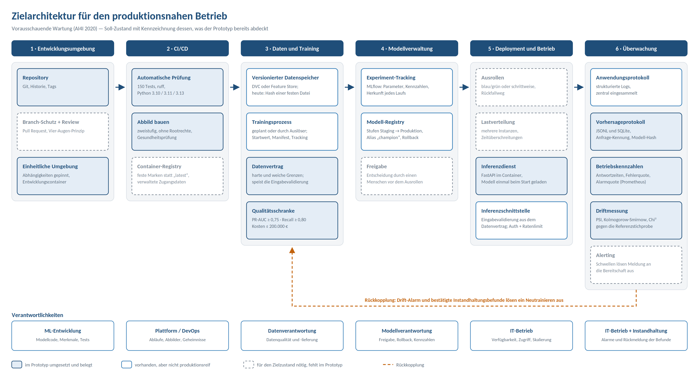

## Business Context

Ungeplante Maschinenausfälle können für Unternehmen erhebliche Kosten verursachen. Neben direkten Reparaturkosten können Produktionsunterbrechungen, Verzögerungen bei der Auftragsabwicklung und zusätzliche Wartungsaufwände entstehen.

**Predictive Maintenance** verfolgt das Ziel, mögliche Maschinenausfälle frühzeitig zu erkennen. Anstatt Wartungsarbeiten ausschließlich nach festen Zeitplan oder erst nach einem Ausfall durchzuführen, werden vorhandene Maschinen- und Sensordaten genutzt, um das Ausfallrisiko vorherzusagen.

In diesem Projekt wird ein Machine-Learning-Modell auf Basis des **AI4I 2020 Predictive Maintenance Dataset** entwickelt. Der Datensatz enthält verschiedene Merkmale einer Maschine, wie Lufttemperatur, Prozesstemperatur, Rotationsgeschwindigkeit, Drehmoment und Werkzeugverschleiß. Zusätzlich enthält er Informationen darüber, ob ein Maschinenausfall aufgetreten ist.
Der Datensatz ist synthetisch. Er bildet eine Fräsmaschine nach festen Regeln
nach und ist nicht an einer realen Anlage gemessen. Reale Sensordaten wären
verrauschter, lückenhafter und würden zusätzliche Schritte zur Datenbereinigung
erfordern. Die Ergebnisse dieses Prototyps sind deshalb nicht unbesehen auf
einen Produktionsbetrieb übertragbar.

Das Business-Ziel besteht darin, anhand dieser Daten frühzeitig Maschinen mit einem erhöhten Ausfallrisiko zu identifizieren. Dadurch könnten Wartungsmaßnahmen gezielter geplant und ungeplante Produktionsstillstände reduziert werden.

Das Projekt betrachtet Predictive Maintenance damit aus einer **Business- und Machine-Learning-Perspektive**:

* frühzeitige Erkennung potenzieller Maschinenausfälle
* Reduzierung ungeplanter Stillstandszeiten
* gezieltere Planung von Wartungsmaßnahmen
* bessere Nutzung vorhandener Maschinen- und Sensordaten
* Unterstützung von Wartungsentscheidungen durch Machine Learning

Ein besonderer Fokus liegt auf der **Erkennung von Ausfällen**, da in einem realen Wartungsszenario das Übersehen eines bevorstehenden Ausfalls erhebliche Auswirkungen haben kann. Deshalb werden neben Accuracy auch Metriken wie **ROC-AUC, PR-AUC / Average Precision, Precision, Recall und F1-Score** betrachtet.


######## Bei Predictive Maintenance ist insbesondere der Recall wichtig, da das Übersehen eines potenziellen Maschinenausfalls zu ungeplanten Produktionsstillständen und zusätzlichen Kosten führen kann. Der F1-Score ermöglicht hingegen eine ausgewogene Bewertung des Verhältnisses zwischen Precision und Recall.


# Predictive Maintenance — MLOps-Prototyp

Prototyp eines vollständigen ML-Systems zur vorausschauenden Wartung: von den
eingefrorenen Rohdaten über Training und Bewertung bis zur lokalen
Schnittstelle, mit Experiment-Tracking, Tests, CI/CD und Überwachung.

Entstanden als Prüfungsleistung im Modul MLOps (Digital Business University of
Applied Sciences).

---

## 1. Fachliche Fragestellung

### Frage

> Fällt diese Maschine in ihrem aktuellen Betriebszustand aus?

Vorhergesagt wird aus Sensor- und Prozessgrößen eines einzelnen Betriebspunkts
— Lufttemperatur, Prozesstemperatur, Drehzahl, Drehmoment, Werkzeugverschleiß
und Qualitätsvariante des Werkstücks.

### Zielgröße

`machine_failure` (0/1) aus dem AI4I-2020-Datensatz. Binäre Klassifikation.

Die Ursachenspalten `TWF`, `HDF`, `PWF`, `OSF`, `RNF` werden **nicht** als
Merkmale verwendet: sie entstehen gemeinsam mit dem Ausfall und sind zum
Vorhersagezeitpunkt nicht bekannt. Ihre Verwendung wäre Data Leakage.

### Klassenverhältnis

339 von 10.000 Betriebszuständen sind Ausfälle — **3,39 % positive Fälle**.

Daraus folgt unmittelbar: **Accuracy scheidet als Metrik aus.** Ein Modell, das
pauschal „kein Ausfall" vorhersagt, erreicht 96,61 % Accuracy und ist
vollkommen wertlos.

### Fehlerkosten

| Fehlerart | Bedeutung | Angenommene Kosten |
|---|---|---|
| Falsch negativ (FN) | Ausfall übersehen — ungeplanter Stillstand, Folgeschäden | 10.000 € |
| Falsch positiv (FP) | Fehlalarm — unnötige Prüfung, kurzer Produktionsstopp | 500 € |
| Richtig positiv (TP) | Ausfall erkannt — geplante Wartung | 800 € |

> **Annahme, nicht Messung.** Die Werte sind geschätzt und stammen nicht aus
> betrieblichen Daten. Entscheidend ist nicht ihre absolute Höhe, sondern das
> Verhältnis von **20 zu 1** zwischen übersehenem Ausfall und Fehlalarm. Es
> bestimmt die Wahl der Metrik und den Entscheidungsschwellenwert.

### Bewertungsmetrik

**Primär: PR-AUC (Average Precision).** Bei 3,39 % positiven Fällen bewertet
die Precision-Recall-Kurve genau das, worauf es ankommt — wie gut das Modell
die seltene Klasse findet, ohne von der übergroßen Mehrheit der Normalfälle
geschmeichelt zu werden.

**Sekundär: erwartete Kosten in Euro.** Sie übersetzen die Modellgüte in die
Größe, über die im Betrieb tatsächlich entschieden wird, und machen das
Kostenverhältnis von 20 zu 1 explizit.

Begleitend werden Recall und Precision am gewählten Schwellenwert berichtet.
ROC-AUC wird nur nachrichtlich geführt: bei stark unausgeglichenen Klassen
fällt sie optimistisch aus.

### Erfolgsschwelle

Vor dem ersten Trainingslauf festgelegt:

| Kriterium | Mindestwert |
|---|---|
| PR-AUC auf der Validierungsmenge | ≥ 0,75 |
| Recall am gewählten Schwellenwert | ≥ 0,80 |

Ein Modell, das diese Werte nicht erreicht, wird nicht als Champion
registriert. Die Schwellen wandern in Etappe 12 als ausführbare
Qualitätsschranke nach `params.yaml`.

---

## 2. Datengrundlage

AI4I 2020 Predictive Maintenance Dataset (Matzka 2020), UCI Machine Learning
Repository, CC BY 4.0. 10.000 Zeilen, 14 Spalten, synthetisch erzeugt.

Die Rohdatei liegt unverändert unter `data/raw/ai4i2020.csv` und ist über
ihren SHA-256-Hash eingefroren. Herkunft, Lizenz, Zitation, Spaltenbedeutungen
und Hash sind in [`references/datenbeschreibung.md`](references/datenbeschreibung.md)
dokumentiert.

---

## 3. Projektstruktur

```
data/
├── raw/              Rohdaten, unverändert (nicht im Git)
├── processed/        abgeleitete Daten, jederzeit neu erzeugbar
└── external/         Fremdquellen
notebooks/            Werkstatt: Erkundung, Belege, Erklärungen
src/                  Fabrik: importierbarer, testbarer Code
├── config.py         Pfade und params.yaml — die einzige Stelle, die beides kennt
├── data/             laden, prüfen, aufbereiten, aufteilen
├── features/         Merkmalskonstruktion
├── modeling/         Training, Abstimmung, Bewertung, Tracking
├── serving/          api.py, schemas.py, model_service.py
├── monitoring/       drift.py, simulate_drift.py
├── pipelines/        run_pipeline.py — die Kette als ein Befehl
└── utils/            Protokollierung, Abbildungsstil, Herkunftsangaben
tests/                pytest
models/               trainierte Artefakte (nicht im Git)
reports/              Kennzahlen, Abbildungen, Laufmanifeste
monitoring/           Überwachungskonzept
references/           Datenbeschreibung und Quellen
scripts/              fetch_data.py — Rohdaten holen und Hash prüfen
.github/workflows/    CI und Lauf nach Zeitplan
params.yaml           alle Zahlen, Schwellen und Zusagen des Projekts
pyproject.toml        Paket, Testlauf und ruff-Regeln
.pre-commit-config.yaml  Prüfungen vor jedem Commit
Dockerfile.api        Abbild der Schnittstelle, zweistufig
docker-compose.yml    Schnittstelle und (auf Verlangen) MLflow
.dockerignore         was nicht in den Bau-Kontext kommt
.env.example          Vorlage für Zugangsdaten (.env liegt nicht im Git)
```

Zwei Dateien steuern das Projekt, und sie sind bewusst getrennt: `params.yaml`
enthält die Entscheidungen — Startwert, Anteile, Hyperparameter, Kosten,
Schwellenwert, Qualitätsschranke. Sie gehört ins Git, denn sie ist Teil des
Ergebnisses. `.env` enthält, was zu *einem Rechner* gehört und niemals
versioniert wird; `.env.example` zeigt nur die Schlüsselnamen.

`src/config.py` ist die einzige Stelle, die die Projektwurzel kennt. Alle Module
holen ihre Pfade dort ab, statt sie relativ zusammenzusetzen — ein
`"../data/processed"` funktioniert im Notebook und bricht im Test, weil dort das
Arbeitsverzeichnis ein anderes ist.

Die Trennung ist keine Kosmetik: Notebooks sind die Werkstatt, `src/` ist die
Fabrik. Sobald etwas im Notebook funktioniert, wandert es als Funktion nach
`src/`, und das Notebook importiert sie zurück.

---

## 4. Einrichtung

### Voraussetzungen

| | |
|---|---|
| Python | 3.10 oder neuer (entwickelt auf 3.13, geprüft auf 3.10, 3.11 und 3.13) |
| Docker | nur für Abschnitt „Container" nötig, sonst nicht |
| Internet | einmal zum Holen der Rohdaten und der Pakete; danach läuft alles ohne |
| Plattenplatz | etwa 600 MB für die Pakete, 3 MB für Daten und Modell |

Alle Befehle dieses Dokuments stehen auch im `Makefile`. `make` ohne Argument
zeigt sie mit einer Zeile Erklärung an — das ist die kürzeste Form von
Dokumentation, weil man sie ausführen kann.

```bash
python3 -m venv .venv
source .venv/bin/activate
python -m pip install -r requirements.txt
```

`requirements.txt` nennt die benötigten Pakete mit Mindestversionen,
`requirements-lock.txt` die exakt installierten. Für einen reproduzierbaren
Nachbau die Sperrdatei verwenden:

```bash
python -m pip install -r requirements-lock.txt
```

Umgebungsvariablen (optional, nur für abweichende Ablageorte):

```bash
cp .env.example .env
```

Rohdaten wiederherstellen:

```bash
python scripts/fetch_data.py
```

Das Skript lädt das Archiv vom UCI-Repository, entpackt die CSV-Datei nach
`data/raw/` und prüft ihren SHA-256 gegen `params.yaml`. Weicht er ab, bricht es
ab — dann hat die Quelle die Datei verändert und keine bisherige Kennzahl ist
mehr vergleichbar. Ohne Netzzugang: Archiv von Hand laden (URL in
`references/datenbeschreibung.md`) und mit `--zip <Pfad>` übergeben.

---

## 5. Nutzung

Der eine Befehl, der alles herstellt — von den Rohdaten bis zum geprüften,
gespeicherten Modell:

```bash
python -m src.pipelines.run_pipeline
python -m src.pipelines.run_pipeline --no-mlflow    # ohne Protokollierung
```

Dabei entstehen:

| Datei | Inhalt |
|---|---|
| `data/processed/{train,val,test}.parquet` | die drei Teilmengen, geschichtet aufgeteilt |
| `data/processed/reference_sample.csv` | Maßstab der Driftprüfung (1.000 Zeilen) |
| `models/model.joblib` | Pipeline, Schwellenwert, Kennzahlen, Herkunft |
| `reports/model_results.json` | Kennzahlen und Urteil der Qualitätsschranke |
| `reports/pipeline_run.json` | das Manifest des Laufs |

Das Manifest beantwortet in einer Datei, was jede Prüfung fragt: Zeitstempel,
Dauer je Schritt, SHA-256 von Rohdatei, `params.yaml` und Modell,
Git-Commit, Startwert, Bibliotheksversionen, Kennzahlen und das Urteil der
Qualitätsschranke. Fällt die Schranke durch, endet der Lauf mit Rückgabewert 1,
das Manifest hält den Fehler fest, und das bisherige Modell bleibt unberührt.

### Schnittstelle

```bash
uvicorn src.serving.api:app --reload --port 8000
```

Danach `http://localhost:8000/docs` öffnen — FastAPI erzeugt aus den Typangaben
eine bedienbare Oberfläche. Endpunkte:

| Endpunkt | Zweck |
|---|---|
| `GET /health` | Läuft der Dienst, ist ein Modell geladen? |
| `GET /model-info` | Welches Modell, welcher Schwellenwert, welche Herkunft? |
| `POST /predict` | Einzelvorhersage |
| `POST /predict/batch` | 1 bis 1000 Betriebspunkte auf einmal |
| `GET /metrics` | Betriebskennzahlen im Prometheus-Format |

Die Wertebereiche der Eingabe stammen aus dem Datenvertrag in `params.yaml`:
harte Grenzen werden mit Statuscode 422 abgelehnt, weiche Grenzen beantwortet und
als `warnings` in der Antwort gemeldet. Ohne Modelldatei startet der Dienst
trotzdem und meldet `status: degraded`; die Vorhersage-Endpunkte antworten dann
mit 503.

```bash
curl -X POST http://localhost:8000/predict -H "Content-Type: application/json" \
  -d '{"type":"L","air_temperature_k":302.0,"process_temperature_k":310.5,
       "rotational_speed_rpm":1320,"torque_nm":64.0,"tool_wear_min":215}'
```

### Protokoll auswerten

Jede Vorhersage wird mitgeschrieben — als JSON-Zeile in
`reports/predictions.jsonl` und in die Tabelle `predictions` in
`reports/predictions.db`. Auswertung:

```bash
python -m src.serving.prediction_log
```

```sql
SELECT date(timestamp) AS tag, COUNT(*) AS anfragen,
       AVG(alarm) AS alarmquote, AVG(latency_ms) AS antwortzeit_ms
FROM predictions GROUP BY tag ORDER BY tag DESC;
```

Ein Eintrag je **Zeile**, nicht je Anfrage: Ein Stapel mit 100 Betriebspunkten
erzeugt 100 Einträge mit derselben `request_id`. Darauf setzt die Driftprüfung
in Etappe 18 auf. Das Anwendungsprotokoll (Start, Fehler, Warnungen) liegt
getrennt davon in `reports/api.log`; die Stufe steht in `params.yaml` und lässt
sich über `LOG_LEVEL` überschreiben.

### Container

```bash
# Modell muss vorliegen — es liegt nicht im Git
python -m src.pipelines.run_pipeline

docker compose up --build
curl http://localhost:8000/health
docker compose down
```

Die MLflow-Oberfläche startet nur auf Verlangen:
`docker compose --profile tracking up`.

`Dockerfile.api` baut in **zwei Stufen**: Die erste installiert
`requirements-api.txt` in eine Umgebung unter `/opt/venv`, die zweite kopiert nur
diese Umgebung und den Code. So landen pip, Paketspeicher und Übersetzerreste
nicht im fertigen Abbild. Weitere Festlegungen, jede mit Begründung in der Datei:

- **Eigener Benutzer ohne Rechte** (`USER dienst`) — ein Dienst, der Vorhersagen
  liefert, braucht kein root.
- **`HEALTHCHECK`** auf `/health`, mit `--start-period`, damit das Laden des
  Modells nicht als Fehler gilt. Der Container meldet sich selbst als gesund
  oder krank.
- **Das Modell steckt im Abbild**, nicht in einem eingehängten Verzeichnis.
  Abbild und Modell sind zusammen ein versioniertes Artefakt, und der Hash in
  `/model-info` gehört zu genau diesem Abbild. Für die Entwicklung ist die
  Alternative in `docker-compose.yml` beschrieben.
- **Die Protokolle liegen in einem benannten Datenträger**, sonst wären die
  protokollierten Vorhersagen nach einem Neustart weg — und die Driftprüfung
  hätte keine Grundlage mehr.
- **`.dockerignore`** hält `.venv`, Rohdaten, Notebooks und Laufdaten aus dem
  Bau-Kontext heraus.

`requirements-api.txt` enthält nur, was die Schnittstelle wirklich lädt: kein
mlflow, kein matplotlib, keine Testwerkzeuge. 39 Pakete statt 169.
`tests/test_container.py` prüft diesen Satz gegen die tatsächlichen Importe —
fehlt ein Paket, schlägt der Test an, nicht erst der Container beim Start.

### Automatische Prüfung bei jedem Push

`.github/workflows/ci.yml`, drei Abläufe:

| Ablauf | Was | Python |
|---|---|---|
| `qualitaet` | installieren, `ruff check`, `ruff format --check`, `pytest` | 3.10, 3.11, 3.13 |
| `pipeline` | Rohdaten holen und Hash prüfen, ganze Kette rechnen, alle Tests, Driftnachweis | 3.11 |
| `container` | Abbild bauen, starten, `/health` abwarten, `/predict` abfragen | 3.11 |

Der zweite Ablauf wartet auf den ersten: Daten zu holen und ein Modell zu
trainieren hat keinen Sinn, wenn schon die Formatierung nicht stimmt. Er legt
Manifest, Kennzahlen und Driftberichte als Artefakt ab und schreibt die
Kennzahlen samt aller Hashes in die Zusammenfassung des Laufs.

Weil die Rohdaten nicht im Repository liegen, melden sich im ersten Ablauf
42 Tests selbst ab; die übrigen 108 laufen. Erst der zweite Ablauf hat
Daten — dort laufen alle 150.

`.github/workflows/monitoring.yml` läuft nach Zeitplan (montags) und macht die
Zusage aus dem Überwachungskonzept ausführbar: die Kette neu rechnen, prüfen,
dass die Referenzstichprobe unverändert herauskommt, und die Driftszenarien
nachweisen. Ein Lauf, der nichts verändert, ist der Beweis, dass die Kette noch
funktioniert.

Der Container-Ablauf bekommt das Modell als **Artefakt aus dem
Pipelinelauf** — nicht aus dem Repository und nicht aus einem frischen Training.
Zum Schluss vergleicht er den SHA-256 des Artefakts mit dem, den `/model-info`
im laufenden Container meldet: Damit ist belegt, dass genau das geprüfte Modell
antwortet.

**Was „CD" hier bedeutet, und was fehlt.** Ausgeliefert wird in diesem Projekt
das geprüfte Container-Abbild, nicht ein Deployment in eine Laufzeitumgebung. Für ein echtes Deployment fehlen: eine Registry für das
Abbild, verwaltete Zugangsdaten, getrennte Umgebungen mit einer Freigabe
dazwischen, ein Rückfallweg auf die vorige Version, eine Startprüfung gegen den
laufenden Dienst und die Infrastruktur, auf der er läuft. Das sind
organisatorische und betriebliche Voraussetzungen, keine fehlenden Codezeilen —
sie hier zu simulieren würde einen Zustand vorspiegeln, den es nicht gibt.

### Codequalität

```bash
ruff check src tests          # Prüfung
ruff check src tests --fix    # mit Korrektur
ruff format src tests         # Formatierung
```

Die Regeln stehen in `pyproject.toml`, Abschnitt `[tool.ruff]`: E/W Stil,
F Fehler, I Importordnung, UP Modernisierung, B häufige Fallen,
C4 unnötige Zwischenlisten. Zeilenlänge 100.

Damit unformatierter Code gar nicht erst in einen Commit gelangt:

```bash
python -m pip install pre-commit
pre-commit install            # einmalig nach dem Klonen
pre-commit run --all-files    # alles von Hand prüfen
```

`.pre-commit-config.yaml` führt `ruff` und `ruff-format` aus, dazu
Dateihygiene (Zeilenende, Leerzeichen, YAML/TOML/JSON gültig, keine
Konfliktmarkierungen, keine vergessenen Haltepunkte, keine großen Dateien).

Zwei bewusste Ausnahmen, beide mit Begründung in den Konfigurationsdateien:

- **Die Notebooks werden nicht geprüft.** Dort sind Importe mitten im Dokument,
  Variablen nur für die Anzeige und lange Ausdrücke gewollt. Die Fabrik in
  `src/` wird geprüft, die Werkstatt nicht.
- **Die Whitespace-Haken fassen Notebooks nicht an.** In den gespeicherten
  Ausgaben stehen pandas-Tabellen, deren Spalten mit Leerzeichen ausgerichtet
  sind — ein Haken, der Leerzeichen am Zeilenende entfernt, würde Belege
  verfälschen.

### Überwachung

```bash
# protokollierte Anfragen gegen die Referenzstichprobe prüfen
python -m src.monitoring.drift

# eine Datei prüfen
python -m src.monitoring.drift --aktuell data/processed/val.parquet

# Nachweis, dass die Überwachung anschlägt (Rückgabewert 1, wenn nicht)
python -m src.monitoring.simulate_drift --details
```

Gemessen werden drei Ebenen: **Datendrift** (PSI je Merkmal, dazu
Kolmogorow-Smirnow für numerische und Chi² für kategoriale Merkmale),
**Vorhersagedrift** (PSI über die ausgegebenen Wahrscheinlichkeiten, plus
Alarmquote) und **Betriebskennzahlen** aus `/metrics`. Maßstab ist
`data/processed/reference_sample.csv`, eine Stichprobe der Validierungsmenge,
die jeder Pipelinelauf neu schreibt.

Warum alle drei Ebenen, mit gemessenen Zahlen, und was welcher Schwellenwert
auslöst: [`monitoring/monitoring_concept.md`](monitoring/monitoring_concept.md).
Kurzfassung: Bei einem Prozesstemperatursensor, der 3 K zu viel meldet, bleibt
die Alarmquote bei 6,0 % statt 5,7 % praktisch unverändert — der Recall fällt
aber von 0,863 auf 0,627. Wer nur Betriebskennzahlen überwacht, sieht einen
ruhigen Dienst und übersieht, dass das Modell blind geworden ist.

### Einzelne Schritte

Die Schritte der Kette lassen sich auch für sich aufrufen:

```bash
# Rohdaten holen und gegen den eingefrorenen SHA-256 prüfen
python scripts/fetch_data.py
python scripts/fetch_data.py --zip ~/Downloads/ai4i.zip   # ohne Netzzugang

# Aufgelöste Konfiguration anzeigen: Pfade, Eckwerte, Ablageort der Laufdaten
python -m src.config

# Rohdaten prüfen und Eckdaten ausgeben (Hash, Zeilen, Klassenverhältnis)
python -m src.data.load

# Rohdaten gegen den Datenvertrag aus params.yaml prüfen
python -m src.data.validate

# Leakage-Spalten entfernen und geschichtet aufteilen -> data/processed/
python -m src.data.split

# Baselines trainieren und bewerten -> reports/baseline_results.json
python -m src.modeling.baseline

# Kostenminimalen Entscheidungsschwellenwert suchen
python -m src.modeling.threshold

# Fehler nach Segmenten zerlegen -> reports/error_slicing.json
python -m src.modeling.error_slicing

# Trainingslauf mit Protokollierung in MLflow
python -m src.modeling.train --name "mein_lauf"
python -m src.modeling.train --no-mlflow        # ohne Protokollierung

# MLflow-Oberfläche
mlflow ui --backend-store-uri sqlite:///mlflow.db

# Testsuite
pytest                      # alle Tests
pytest -m "not langsam"     # ohne die Tests, die ein Modell trainieren
```

Die Notebooks liegen unter `notebooks/`, die erzeugten Abbildungen unter
`reports/figures/`.

Weitere Befehle kommen mit den folgenden Etappen hinzu (Pipeline,
Schnittstelle, Überwachung).

---

## 6. Zielarchitektur

Der Zielzustand eines produktionsnahen Betriebs in sechs Stufen. Der Hauptfluss
verläuft von der Entwicklungsumgebung bis zur Überwachung, die gestrichelte
Rückkopplung schließt den Kreis zum Training.

Die Einfärbung trennt Soll und Ist — die Legende steht unten im Bild. Unter den
sechs Stufen liegt das Band der Verantwortlichkeiten.



### Verantwortlichkeiten

| Stufe | Rolle | Zuständig für |
|---|---|---|
| 1 Entwicklungsumgebung | ML-Entwicklung | Modellcode, Merkmale, Tests |
| 2 CI/CD | Plattform / DevOps | Abläufe, Abbilder, Zugangsdaten |
| 3 Daten und Training | Datenverantwortung | Datenqualität und -lieferung |
| 4 Modellverwaltung | Modellverantwortung | Freigabe, Rollback, Kennzahlen |
| 5 Deployment und Betrieb | IT-Betrieb | Verfügbarkeit, Zugriff, Skalierung |
| 6 Überwachung | IT-Betrieb + Instandhaltung | Alarme, Rückmeldung bestätigter Befunde |

Im Prototyp sind diese Rollen benannt, aber keiner Person zugeordnet — eine
Einzelperson nimmt sie alle wahr.

### Was das Bild zeigt

Die gestrichelten Kästen häufen sich in den Stufen 1, 5 und 6: Review, Freigabe,
Ausrollen, Alarmierung. Das sind durchweg Verfahren und Zuständigkeiten, keine
Algorithmen. **Die Lücke zwischen Prototyp und Zielzustand ist überwiegend
organisatorischer und nicht technischer Natur.**

Zwei Pfeile tragen die Architektur. Die Qualitätsschranke steht **vor** der
Modellverwaltung — ein schlechteres Modell erreicht das Register nicht und
überschreibt das bisherige nicht. Und die Rückkopplung beginnt bei der
Überwachung, nicht bei einem Zeitplan: Neu trainiert wird, weil sich etwas
geändert hat, nicht weil ein Monat vergangen ist.

Die Abbildung oben liegt als `reports/figures/19_zielarchitektur.png` im
Repository und wird im Reflexionsreport unverändert verwendet — eine Quelle,
eine Darstellung.

---

## 7. Erwartete Ergebnisse

Alle Zahlen stammen aus Läufen dieses Repositories mit `seed: 42`; sie sind
reproduzierbar (`make pipeline`).

### Der Weg zum Modell

| Schritt | PR-AUC | Bemerkung |
|---|---|---|
| Kein Alarm (immer 0) | 0,034 | entspricht dem Anteil positiver Fälle |
| Zufall im richtigen Verhältnis | 0,037 | die eigentliche Nulllinie |
| Logistische Regression | 0,357 | einfachste ernsthafte Lösung |
| Random Forest, Rohspalten | 0,743 | |
| **+ abgeleitete Merkmale** | **0,843** | **+0,101 — der größte Einzelgewinn** |
| + Hyperparameter abgestimmt | 0,861 | nur +0,018 für 30 Suchläufe |
| gewählt: 150 statt 379 Bäume | 0,860 | gleiche Güte, halbe Antwortzeit |

Zum Vergleich mit Ursachenspalten (Data Leakage): **0,963** — und im Betrieb
nutzlos, weil diese Spalten zum Vorhersagezeitpunkt nicht bekannt sind.

Kreuzvalidierung auf der Trainingsmenge (5 Faltungen): Random Forest
0,903 ± 0,042, XGBoost 0,864 ± 0,030, logistische Regression 0,505 ± 0,068.

### Entscheidungsregel

| Schwellenwert | Kosten auf der Validierungsmenge | Recall |
|---|---|---|
| nichts tun | 510.000 € | 0,000 |
| 0,50 (Voreinstellung) | 170.100 € | 0,725 |
| **0,06 (gewählt)** | **126.200 €** | **0,863** |

### Validierungsmenge (1.500 Zeilen, 51 Ausfälle)

PR-AUC 0,8604 · ROC-AUC 0,9520 · Recall 0,8627 · Precision 0,5116 ·
erwartete Kosten 126.200 €

### Testmenge — einmalige Messung

Die Testmenge wurde im ganzen Projekt **genau einmal** angefasst, nach Abschluss
aller Entscheidungen (`make abschluss`, Bericht in
`reports/final_test_evaluation.json`):

| | Wert | 95-%-Intervall |
|---|---|---|
| PR-AUC | **0,9376** | 0,8775 – 0,9861 |
| Recall | **0,9608** | 0,9000 – 1,0000 |
| Precision | 0,4712 | |
| TP / FP / FN | 49 / 55 / 2 | von 51 Ausfällen |
| erwartete Kosten | **86.700 €** | gegenüber 510.000 € bei Nichtstun |

Beide Erfolgsschwellen aus Etappe 1 (PR-AUC ≥ 0,75, Recall ≥ 0,80) sind erfüllt.

**Wie dieses Ergebnis zu lesen ist.** Es liegt über der Validierungsmenge
(+0,077 PR-AUC). Das ist **kein** Beleg dafür, dass das Modell besser ist als
gedacht: Bei 51 positiven Fällen ist das Vertrauensintervall 0,11 breit, und der
Validierungswert liegt knapp an seiner Untergrenze. Der Unterschied ist
Stichprobenschwankung zweier kleiner Teilmengen, nicht Fortschritt. Belastbar
ist: Das Modell findet im Bereich von etwa 88 bis 99 % PR-AUC, und es übersieht
auf dieser Teilmenge 2 von 51 Ausfällen.

### Die Qualitätsschranke greift — nachgewiesen

In Notebook 08 wird absichtlich ein zu schwaches Modell trainiert (`max_depth: 1`
statt 10). Das Ergebnis liegt als Beleg bei, in
`reports/gegenprobe_qualitaetsschranke.json`:

```
PR-AUC        — 0,647 liegt unter der Mindestanforderung 0,75
Recall        — 0,451 liegt unter der Mindestanforderung 0,80
erwartete Kosten — 303.400 EUR übersteigen die Obergrenze 200.000 EUR
```

Alle drei Anforderungen gerissen, der Lauf endet mit Rückgabewert 1 — und
entscheidend: **`models/model.joblib` wurde nicht überschrieben.** Ein
schlechterer Lauf ersetzt das bestehende Modell nicht. Die Kennzahlen werden
trotzdem abgelegt, damit man nachlesen kann, woran es lag.

### Wo das Modell danebenliegt

Die Fehlerzerlegung (Notebook 09, `python -m src.modeling.error_slicing`) auf der
Validierungsmenge beantwortet, was die Gesamtzahl verdeckt: **welche Art** von
Ausfall übersehen wird. Dafür werden die Ursachenspalten wieder herangezogen —
als Diagnose, nicht als Merkmal.

| Ausfallart | gefunden | Recall |
|---|---|---|
| OSF — Überlastung | 17 von 17 | 100 % |
| PWF — Leistung außerhalb des Bereichs | 15 von 15 | 100 % |
| HDF — Wärmeabfuhr | 12 von 12 | 100 % |
| **TWF — Werkzeugverschleiß** | **3 von 8** | **37,5 %** |
| ohne eingetragene Ursache | 0 von 2 | 0 % |

**Alle sieben übersehenen Ausfälle sind Verschleißausfälle (5) oder Ausfälle ohne
eingetragene Ursache (2).** Jeder Ausfall, der eine Signatur in den Messwerten
hinterlässt, wurde gefunden — und genau diese drei Signaturen sind die
abgeleiteten Merkmale aus Notebook 04 (Temperaturdifferenz, Leistung,
Verschleiß × Drehmoment). Der Verschleißausfall hat keine solche Signatur: Zwei
Maschinen mit identischen Messwerten können die eine ausfallen und die andere
weiterlaufen. Das ist die Obergrenze des Recalls, und sie liegt im Datensatz,
nicht im Modell.

Dieselbe Aussage in den Einzelscheiben: Die Scheiben mit Recall 0 % liegen alle
im normalen Betriebsbereich (mittleres Drehmoment, mittlere Drehzahl), wo wenige
und unauffällige Ausfälle stattfinden. In den Randbändern liegt der Recall bei
97 bis 100 %. Die Kosten dagegen konzentrieren sich im obersten Verschleißband
(70 % der Gesamtkosten bei 83,9 % Recall) — wo der Recall schlecht ist und wo das
Geld liegt, sind zwei verschiedene Fragen.

### Überwachung

| Szenario | größtes PSI | Alarmquote | Recall | Urteil |
|---|---|---|---|---|
| keine Drift (Kontrolle) | 0,002 | 5,7 % | 0,863 | stabil |
| Prozesstemperatur 3 K zu hoch | 4,689 | 6,0 % | **0,627** | handeln |
| Verschleiß +60 min | 3,772 | 32,3 % | 0,961 | handeln |
| 80 % Variante H | 2,950 | 5,7 % | 0,863 | handeln |

### Laufzeiten

| | |
|---|---|
| ganze Kette (`make pipeline`) | ≈ 0,5 s |
| Testsuite (150 Tests) | ≈ 1,3 s |
| Einzelvorhersage über HTTP | ≈ 15 ms (davon 13 ms der Wald) |
| Stapel von 100 Zeilen | 0,15 ms je Zeile — 98× schneller |

---

## 8. Bewusste Entscheidungen und ihr Preis

Jede dieser Entscheidungen war eine Abweichung vom Naheliegenden. Der Preis
steht dabei, weil es keine kostenlosen gibt.

| Entscheidung | Warum | Preis |
|---|---|---|
| Ursachenspalten entfernt | sie entstehen mit dem Ausfall, sind vorher unbekannt | PR-AUC fällt von 0,963 auf 0,743 — das Modell sieht schlechter aus und ist erst dadurch brauchbar |
| PR-AUC und Euro statt Accuracy | bei 3,4 % positiven Fällen ist Accuracy nutzlos (96,6 % durch Nichtstun) | zwei Kennzahlen mehr zu erklären |
| Schwellenwert 0,06 statt 0,5 | Fehlerkosten stehen 20 : 1 | 42 Fehlalarme auf 1.500 Zeilen, Precision 0,51 — gewollt, weil ein Fehlalarm 500 € kostet und ein übersehener Ausfall 10.000 € |
| 150 Bäume statt der gefundenen 379 | gleiche Güte (0,860 gegen 0,861) | nichts messbares — dafür 2,96 ms statt 5,41 ms und ein Drittel der Modellgröße |
| Random Forest statt XGBoost | besser in der Kreuzvalidierung **und** einfacher | bei langer Feinabstimmung könnte XGBoost aufholen |
| Merkmale im `FunctionTransformer` **in** der Pipeline | sonst muss die Schnittstelle die Formeln ein zweites Mal rechnen — Training-Serving-Skew | MLflow muss mit `cloudpickle` statt `skops` speichern, weil eine eigene Funktion darin steckt |
| Qualitätsschranke vor dem Speichern | ohne sie überschreibt irgendwann ein schlechterer Lauf das gute Modell | ein Lauf kann ohne Ergebnis enden (Rückgabewert 1) |
| alle Zahlen in `params.yaml` | änderbar ohne Python | eine Ebene mehr Indirektion; im Code steht nirgends mehr der Wert selbst |
| Protokoll als JSONL **und** SQLite | das eine ist anhängbar und lesbar, das andere per SQL auswertbar | jede Vorhersage wird zweimal geschrieben (im Hintergrund, ohne die Antwortzeit zu verlängern) |
| Modell im Container-Abbild, nicht eingehängt | Abbild und Modell sind zusammen **ein** versioniertes Artefakt | jedes neue Modell braucht einen Neubau |
| Notebooks nicht gelintet | dort sind Importe mitten im Dokument und Anzeigevariablen gewollt | die Werkstatt hat niedrigere Standards als die Fabrik — bewusst |
| Python-Untergrenze 3.10 | der Code braucht nichts Neueres; breiter lauffähig in Container und CI | kein `datetime.UTC`, `timezone.utc` bleibt |
| Testmenge genau einmal | nur so ist sie eine Aussage über unbekannte Daten | keine Nachjustierung mehr möglich — das Ergebnis steht, wie es steht |

---

## 9. Offene Punkte und Grenzen

Was dieser Prototyp **nicht** ist, und was zum Produktionsbetrieb fehlt:

- **Die wahren Labels.** Im Betrieb kommt ein bestätigter Ausfall aus der
  Instandhaltungsrückmeldung — Tage bis Wochen später. Ein *verhinderter* Ausfall
  liefert gar kein eindeutiges Label. Ohne einen Prozess, der jeden Alarm mit
  Befund zurückschreibt, gibt es kein Neutraining auf Betriebsdaten. Das ist die
  größte Lücke, und sie ist organisatorisch, nicht technisch
  ([Konzept, Abschnitt 6](monitoring/monitoring_concept.md)).
- **Kein Deployment.** Ausgeliefert wird das geprüfte Abbild. Registry,
  Zugangsdaten, getrennte Umgebungen, Freigabe, Rückfallweg und Infrastruktur
  fehlen (Abschnitt „Automatische Prüfung bei jedem Push").
- **Rollen benannt, nicht besetzt.** Wer welche Meldung bekommt, steht im
  Konzept; es gibt keinen Bereitschaftsplan.
- **Die Überwachungsschwellen sind begründet, aber nicht kalibriert.** PSI 0,10
  und 0,25 sind übliche Werte, nicht an dieser Anlage gemessen. Die erste
  Betriebsphase dient dazu.
- **`RNF` setzt eine Obergrenze.** Die Zufallsausfälle im Datensatz sind
  definitionsgemäß nicht vorhersagbar; Recall 1,0 ist unerreichbar.
- **Der Datensatz ist synthetisch.** Keine Zeitachse, also keine saisonale
  Drift, keine Alterung über Monate, keine Wechselwirkung zwischen Maschinen.

---


